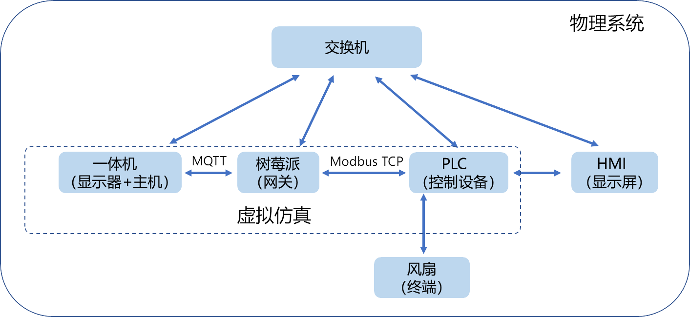
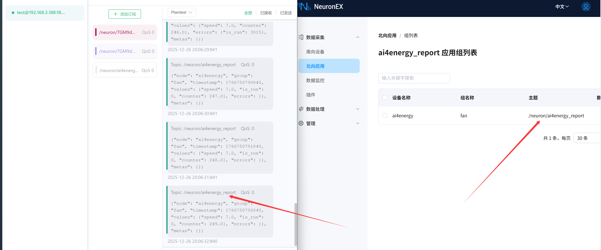
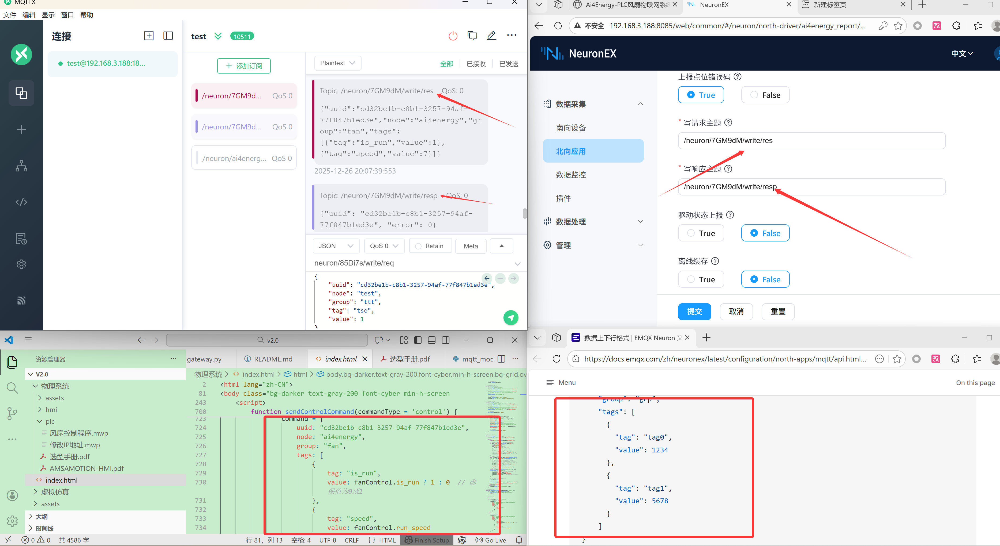
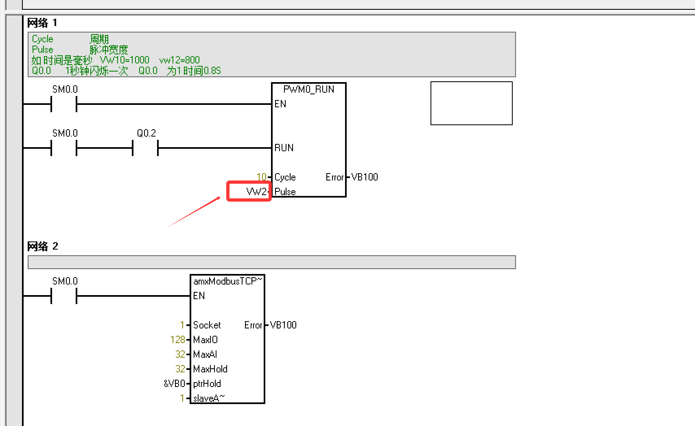
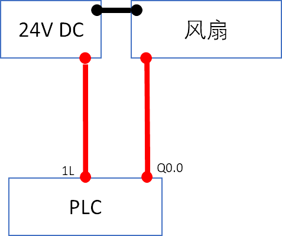

# 物联网 v2.0.0

## 0 整体介绍

### 架构

  

其中：

#### 物理系统

物理系统是实际设备搭建 的实物系统，包括：

1. **一体机（主机+显示）：** 实现数据采集与上位机指令下发。运行前端index.html可打开控制大屏。
2.	**树莓派（网关）：** 其本质为一个小型计算机，是v1.0.0中ESG8200网关的平替，功能上等价于手搓了一个ESG8200网关，并实现数据采集与上报与上位机指令监听与下发，同时部署`EXQX`的MQTT服务器。
3.	**PLC：** 传统工业上的可编程逻辑设备，运行Modbus TCP服务与网关通讯，并通过PWM指令控制风扇速度。功能上与V1.0.0中的8266模块等效。
4. **风扇：** 物理设备，只有两根线，规格为24V-0.75A。功能上与V1.0.0中的传感器设备等效。
5. **HMI：** 人机交互设备，可直接控制PLC，并显示相关状态。

以上设备的IP均设为固定IP，在192.168.3.0/24网段内。

#### 仿真系统

仿真系统是用代码或者模拟器来模拟设备，是实物系统的仿真体，可以方便的对整个技术链路进行测试，包括：

1. **设备端** 模拟Modbus TCP设备。
2. **网关** 模拟网关。
3. **前端** Index.html页面。

可以先由仿真系统开始，理解整体流程：

#### 设备端

模拟提供Modbus TCP服务的设备，运行[modbus_device.py](虚拟仿真\modbus_device.py)。该脚本用pymodbus库模拟Modbus TCP设备。

#### 客户端

模拟客户端通过Modbus TCP访问提供服务的设备，运行[modbus_control.py](虚拟仿真\modbus_control.py)。该脚本用pymodbus库模拟客户端下发指令实现设备控制。

#### 网关

网关实现从Modbus TCP设备到MQTT服务器的转发，运行[mqtt_modbus_gateway.py](虚拟仿真\mqtt_modbus_gateway.py)。从Modbus TCP设备读取数据，并转发到MQTT服务器。从MQTT服务器监听指令数据，并转发到Modbus TCP设备。

#### MQTT服务器

网关代码中提供了一个MQTT服务器地址：
```
MQTT_BROKER_IP = "182.92.0.11"
MQTT_BROKER_PORT = 1883
```
这是一个在云上运行的MQTT服务器。若在本地运行，可以在本地启动一个EMQX服务，详情见[EMQX文档](https://docs.emqx.com/zh/emqx/latest/deploy/install.html)，并将MQTT_BROKER_IP改为本机IP。

#### 前端

前端可以对模拟设备进行设置。运行[index.html](虚拟仿真\index.html)。若本地运行MQTT服务器，则将前端中的MQTT服务改为本机IP。

### 运行效果

PLC控制风扇通断与风速大小，通过树莓派网关上传至上位机，同时树莓派网关监听上位机的指令，实现上位机对PLC设备的控制。

## 1 一体机

仿真系统中所述的前端、MQTT服务在本例的物理系统中，直接运行在一体机上。一体机作为上位机，完成了设备状态显示和对PLC的指令控制。

一体机IP：192.168.3.187。已配置为固定IP。

一体机为触屏，**单指触屏点击等价于鼠标左键，双指触屏一指点击等价于鼠标右键。从屏幕左端往中央滑动可拖出虚拟键盘。**

一体机已经配置开机自启动[脚本](物理系统\AutoOpenLocalPage.bat)，实现开机全屏用chrome启动前端页面。**该页面退出方法为：拖拽出虚拟键盘，点击Ctrl+W退出。**

已安装Mobaxterm，用于SSH访问树莓派，安装vncviewer64，用于访问树莓派桌面，PLC与HMI相关软件已下载安装包，未安装，可根据文档安装。

## 2 树莓派（网关）

树莓派作为网关，可以直接运行仿真系统中python脚本网关，这样就从功能上实现了v1.0中的ESG8200，也可以运行类似于ESG8200中Node-Red一样的UI配置界面，实现网关的数据处理逻辑。本例中使用EMQX旗下的Neuron作为Node-Red的平替，实现网关的数据处理逻辑。因此，本质上说，树莓派+Neuron = ESG8200网关。

此外，树莓派作为网关，还运行了MQTT服务器，用于数据上传，MQTT是数据传输的桥梁，它可以装在树莓派中运行，也可以在上位机中运行，由于树莓派安装更方便，因此安装在树莓派中。

本案例中树莓派的版本是Raspberry Pi 5，相关的系统烧录可查看[官方文档](https://pidoc.cn/docs/computers/getting-started)。相关的远程访问可查看[文档](https://pidoc.cn/docs/computers/remote-access)。本案例中的树莓派访ssh登录方式铭牌。

树莓派中以根据[Neuron文档](https://docs.emqx.com/zh/neuronex/latest/installation/ubuntu.html)安装了deb版，并配置了开机自启动，运行Neuron。根据[emqx文档](https://www.emqx.com/zh/downloads-and-install/enterprise?os=Debian)安装EMQX了MQTT服务器。

树莓派IP：192.168.3.188

Neuron控制台地址：http://192.168.3.188:8085。
账号密码为：admin/0000

emqx控制台地址：http://192.168.3.188:18083。
账号密码为：admin/ai4energy

### Neuron配置

Neuron控制台的配置在控制台中均可以查看。核心配置有以下几点：

1. 配置数据上报话题；
  
2. 配置指令接收话题（反控），[文档](https://docs.emqx.com/zh/neuronex/latest/best-practise/device-control.html)中有详细说明。在前端代码中也是一一对应。
  


### 固定IP设置方法

使用nmcli 设置固定IP：
```bash
# 1. 修改为静态 IP 模式，固定 IP、网关、DNS，Wired connection 1为连接名称
sudo nmcli con mod "Wired connection 1" \
ipv4.method manual \
ipv4.addresses 192.168.3.188/24 \
ipv4.gateway 192.168.3.1 \
ipv4.dns "192.168.3.1,8.8.8.8"

# 2. 激活配置（立即生效，无需重启）
sudo nmcli con down "Wired connection 1" && sudo nmcli con up "Wired connection 1"
```

查看静态IP是否生效：
```bash
sudo cat /etc/NetworkManager/system-connections/Wired\ connection\ 1.nmconnection | grep -E "method|addresses|gateway"
```

## 3 PLC

PLC采用艾莫迅的200系列200系列PLC，型号214-3AD23-0XB8为，其它型号与型号间的区别可查阅[选型手册](物理系统\plc\选型手册.pdf)，也可以在[官方文档](https://wiki.amsamotion.com/?title=196&doc=207)中查看。编程软件采用V4.0 STEP 7 MicroWIN SP9，[下载链接](https://www.ad.siemens.com.cn/download/materialaggregation_2190.html)及相关问题也可以在[文档](https://wiki.amsamotion.com/?title=5&doc=8)中查看。


PLC中主要功能为：
1. 读取启动了Modbus TCP服务。
2. 运行了PWM指令控制风扇。
这两个功能都采用[官方示例](https://wiki.amsamotion.com/?title=196&doc=207)实现。

梯形图文件为[物理系统\plc\风扇控制程序.mwp](物理系统\plc\风扇控制程序.mwp)中。

PLC可用WIFI远程下载器进行程序下载，相关使用说明见[文档](物理系统\plc\远程下载器使用手册.pdf)，官方文档中亦有详细说明。

### PWM控制原理

PWM（脉冲宽度调制，Pulse Width Modulation）控制直流风扇的核心是：**通过周期性的高低电平脉冲，调节平均电压/电流来改变风扇电机的转速**，而非直接调节电压幅值。直流风扇的转速与输入电压近似成正比，PWM通过控制“有效电压”实现转速调节。

#### 占空比（Duty Cycle）
PWM信号是周期性的方波，定义：
- \( T \)：PWM周期（高低电平的总时长，单位：s）
- \( t_{on} \)：一个周期内高电平的持续时间（单位：s）
- \( D \)：占空比（高电平时间占周期的比例），公式为：
  \[
  D = \frac{t_{on}}{T} \quad (0 \leq D \leq 1)
  \]
  若用百分比表示：\( D_{\%} = D \times 100\% \)。


#### 有效电压（平均电压）计算
直流风扇电机等效为阻性负载（忽略电感特性，或PWM频率足够高时），输入的PWM脉冲经过电机绕组的“积分效应”（电感滤波）后，实际作用在电机两端的是**平均电压**（有效电压）\( V_{avg} \)：
\[
V_{avg} = V_{cc} \times D = V_{cc} \times \frac{t_{on}}{T}
\]
其中：\( V_{cc} \) 为PWM高电平的电压（如5V、12V，即风扇额定电压）。

- 当 \( D=0 \)（全低电平）：\( V_{avg}=0 \)，风扇停转；
- 当 \( D=1 \)（全高电平）：\( V_{avg}=V_{cc} \)，风扇满速运行；
- 当 \( 0<D<1 \)：\( V_{avg} \) 介于0和 \( V_{cc} \) 之间，风扇转速随 \( D \) 增大而提高。


#### 转速与占空比的关系
直流电机的转速公式（忽略负载转矩影响）：
\[
n = \frac{V_{avg} - I R}{K_e \phi}
\]
其中：
- \( n \)：电机转速（单位：r/min 或 rad/s）；
- \( I \)：电机绕组电流（单位：A）；
- \( R \)：绕组内阻（单位：Ω）；
- \( K_e \)：电机反电动势常数（由电机结构决定）；
- \( \phi \)：电机气隙磁通（永磁电机中 \( \phi \) 恒定）。

结合PWM的有效电压 \( V_{avg} = V_{cc} D \)，代入得：
\[
n = \frac{V_{cc} D - I R}{K_e \phi}
\]
在轻负载下，\( I R \)（绕组压降）可忽略，转速近似与占空比成正比：
\[
n \approx \frac{V_{cc}}{K_e \phi} \times D = K \times D
\]
其中 \( K = \frac{V_{cc}}{K_e \phi} \) 为常数（同一款风扇、同一电源电压下）。


#### PWM频率的选择

PWM频率 \( f = \frac{1}{T} \) 需满足：频率过高会增加开关损耗，过低会导致风扇转速波动、产生噪音。
直流风扇的典型PWM频率范围：**20Hz ~ 20kHz**（常用25kHz，人耳不可闻）。

频率选择的约束：电机绕组电感 \( L \) 需能有效滤波，使得电流波动 \( \Delta I \) 足够小。电流波动公式：
\[
\Delta I = \frac{V_{cc} D (1 - D)}{L f}
\]
可见：频率 \( f \) 越高，电流波动越小，转速越平稳。

因此，在官方示例的PWM模块上，只需要修改PWM占空比，即可实现风扇的控制。程序核心如下图：

  

整个风扇控制的核心逻辑为：

**PWM模块中，10代表10ms，即PWM频率为100HZ，VW2为寄存器地址，里面存储1-9，对应低电平的时长，例如VW2为1，则对应10ms中的低电平的时长为1ms。修改VW2存储的数值，即可实现风扇控制。**

同时，该地址和Modbus TCP服务对应地址绑定，即VW2为Modbus TCP服务的40002。对于Modbus TCP客户端来说，向40002地址下发指令，即可实现风扇控制。

整个控制逻辑也体现在虚拟仿真系统代码中。

PLC IP：192.168.3.120

## 4 风扇

风扇为一个简单的电器设备，两根线，一正一负。规格为24V、0.75A。PLC的电流上限为0.5A，**事实上风扇不应该直接由PLC控制**，应外加风扇控制器做隔离，但由于风扇电源为24V外接线提供，PLC只控制通断，因此可以作为示例工程展示原理使用。

PLC控制风扇的接线图为：

  


## 5 HMI

HMI为艾莫迅的HMI系列产品，型号为AMX-MT043IE，手册见[官方文档](https://wiki.amsamotion.com/?title=196&doc=262)，其编程软件也可在[官方文档](https://wiki.amsamotion.com/?title=196&doc=262)中下载。B站有相关的视频介绍。

本示例中的HMI文件为[物理系统\hmi\ai4energy_HMI.hmi](物理系统\hmi\ai4energy_HMI.hmi)：主要包含了一个开关按钮和一个档位输出框。点击开关按钮，即可启动风扇；点击档位输出框，即可设置档位。其本质都是通过作为客户端通过Modbus TCP修改PLC寄存器的数值，从而控制风扇。档位可以直接修改上述PLC寄存器VW2的数值。

开关按钮同理，开关按钮为一个虚拟按钮，控制的是PLC的Q0.2输出，即Modbus TCP的00003地址。开关按钮的开关状态切换可以设置Q0.2的通断，从而控制PWM模块是否工作，进而控制风扇启停。

HMI在传统的工业系统中作为就地显示和控制设备，一般直接PLC进行通信，用于显示PLC的运行状态，并控制PLC的运行。

**HMI与上位机（物联网平台）在控制中的作用本质上是一样的，只是HMI只能完成简易的现场显示和简易控制（因为它直连寄存器），而上位机以及物联网平台则可以完成数据存储与复杂逻辑运算从而实现智能控制。**

HMI IP：192.168.3.121